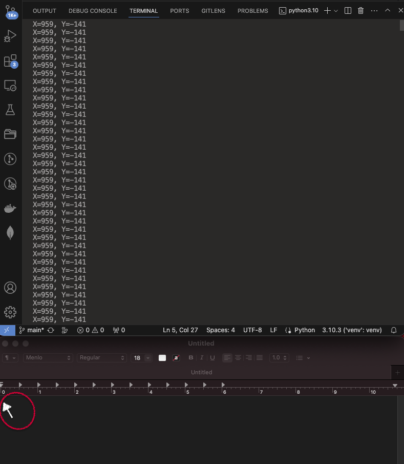

# pyautogui

---

## Basic

Begin Project:

    ❯ python -m venv venv

    ❯ source ./venv/bin/activate

    ❯ pip install pyautogui

    ❯ pip list

        Package                 Version
        ----------------------- -------
        MouseInfo               0.1.3
        pillow                  10.2.0
        pip                     22.0.4
        PyAutoGUI               0.9.54
        PyGetWindow             0.0.9
        PyMsgBox                1.0.9
        pyobjc-core             10.1
        pyobjc-framework-Cocoa  10.1
        pyobjc-framework-Quartz 10.1
        pyperclip               1.8.2
        PyRect                  0.2.0
        PyScreeze               0.1.30
        pytweening              1.2.0
        rubicon-objc            0.4.7
        setuptools              58.1.0

Run Project:

### Code 1.| get position cursor

    import pyautogui

    while True:
        x, y = pyautogui.position()
        print(f"X={x}, Y={y}")

        ❯ python3 getposition.py

    

---