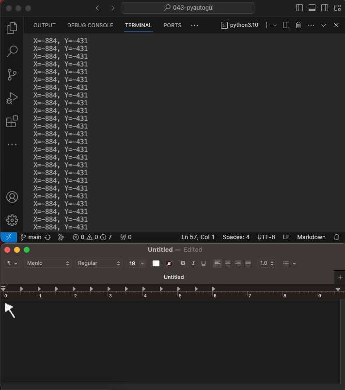
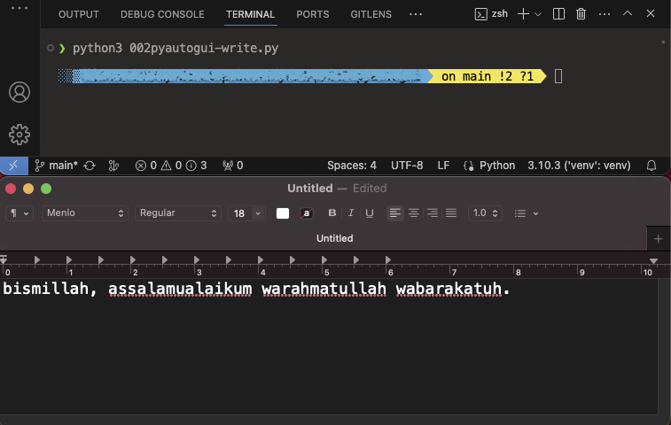
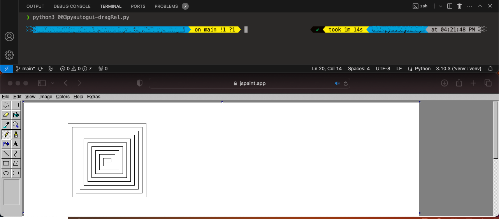

# pyautogui

---

## Basic

Begin Project:

    ❯ python -m venv venv

    ❯ source ./venv/bin/activate

    ❯ pip install pyautogui

    ❯ pip list

        Package                 Version
        ----------------------- -------
        MouseInfo               0.1.3
        pillow                  10.2.0
        pip                     22.0.4
        PyAutoGUI               0.9.54
        PyGetWindow             0.0.9
        PyMsgBox                1.0.9
        pyobjc-core             10.1
        pyobjc-framework-Cocoa  10.1
        pyobjc-framework-Quartz 10.1
        pyperclip               1.8.2
        PyRect                  0.2.0
        PyScreeze               0.1.30
        pytweening              1.2.0
        rubicon-objc            0.4.7
        setuptools              58.1.0

## &#x1F4D6; Spesifikasi OS :

    ❯ system_profiler SPSoftwareDataType SPHardwareDataType

        Software:
            System Software Overview:
                System Version: macOS 13.3.1 (22E261)
                Kernel Version: Darwin 22.4.0
                Boot Volume: Macintosh HD
                Boot Mode: Normal    
                . . .

        Hardware:
            Hardware Overview:
                Model Name: MacBook Pro
                Model Identifier: MacBookPro17,1
                Model Number: MYD82ID/A
                Chip: Apple M1
                Total Number of Cores: 8 (4 performance and 4 efficiency)
                Memory: 8 GB
                . . .

## &#x2699; Konfigurasi pada OS

Berikan akses pada code editor dalam hal ini saya menggunakan Visual Studio Code.

System Settings --> Privacy & Security --> Accessibility --> [tambahkan aplikasi Visual Studio Code]

---

Run Project:

#### &#x1F680; Code 001getposition.py | get position cursor

    import pyautogui

    while True:
        x, y = pyautogui.position()
        print(f"X={x}, Y={y}")

        ❯ python3 getposition.py

    

---

#### &#x1F680; Code 002pyautogui-write.py | write

    import pyautogui

    pyautogui.moveTo(-169,-241)
    pyautogui.click()
    pyautogui.write("bismillah, assalamualaikum warahmatullah wabarakatuh.")

    

---

#### &#x1F680; Code 003pyautogui-dragRel.py | dragrel

    import pyautogui
    import time

    time.sleep(3)

    pyautogui.mouseDown(-100, -241, button="left")
    pyautogui.moveTo(-50, -241, 3)
    pyautogui.mouseUp()
    pyautogui.moveTo(0,-241, 3)

    time.sleep(1)
    distance = 200
    while distance > 0:
        pyautogui.dragRel(distance, 0, 1, button="left")
        distance = distance - 10
        pyautogui.dragRel(0,distance, 1, button="left")
        pyautogui.dragRel(-distance, 0, 1, button="left")
        distance = distance - 10
        pyautogui.dragRel(0,-distance, 1, button="left")
    time.sleep(2)

    

---